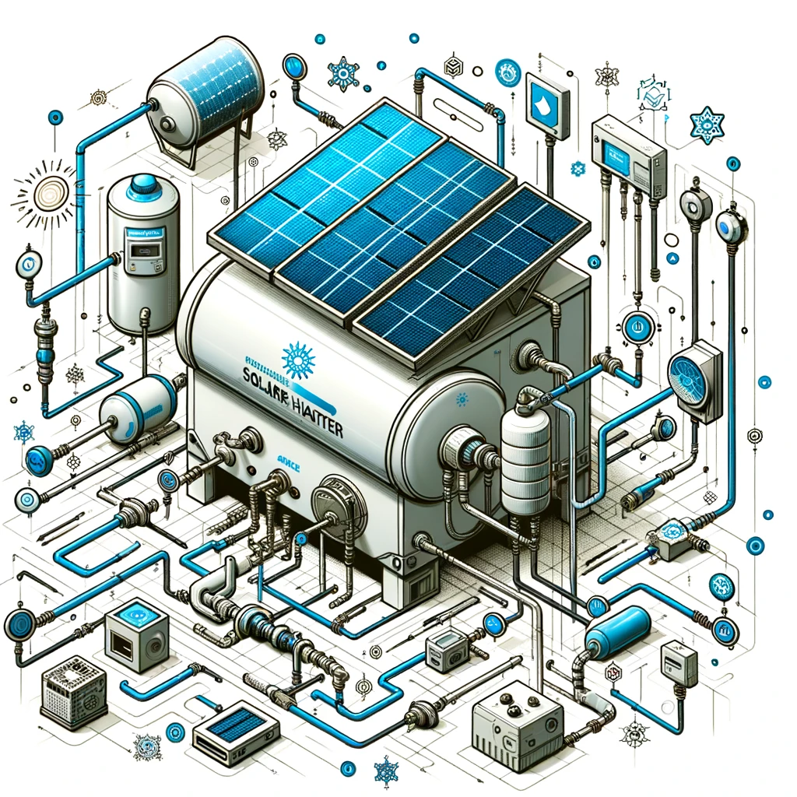

# coding exercise
## solar heater system

### Challenge / Assignment



Given a simplistic diagram of a solar water heating system, do the following:

- The system should simulate the heat transfer from a solar panel to a storage tank
- Use whichever coding language you wish
- We will evaluate thermodynamic correctness, code approach, and result


### Approach
- The solar heater system is modeled using a "closed" singly-linked list as the system structure.
- Each element of the system (SolarCollector, Pump, Pipe, StorageTank) represents a linked list node and extends from a base class called FluidSystemNode.
- The FluidSystemNode class has properties such as type, name, fluidCapacity, and next (which points to the next node in the system).
- The SolarCollector, Pump, Pipe, and StorageTank classes extend the FluidSystemNode class and have additional properties specific to their function in the system.
- The ClosedFluidSystem class manages the entire system. It has methods to insert new nodes into the system, print the system, get all solar collectors in the system, calculate the minimal pump rate required for a given temperature rise, and calculate the total fluid volume and mass in the system.
- When a new node is added to the system using the insert method of the ClosedFluidSystem class, it is automatically linked to the previous node and the head node, forming a closed loop.
- The system is built through composition. A new instance of the ClosedFluidSystem class is created and nodes are added to it using the insert method.
- The total fluid volume and mass in the system are calculated using the totalFluidVolume and totalFluidMass methods of the ClosedFluidSystem class.
- The minimal pump rate required for a given temperature rise is calculated using the calculateMinimalPumpRate method of the ClosedFluidSystem class.
- The energy required to raise the temperature of the fluid is calculated using the `calculateEnergyRequired` function, which takes the mass of the fluid, the specific heat capacity of the fluid, and the desired temperature rise as inputs, and returns the energy required in Joules.
- The pump speed required to achieve a target temperature rise is calculated using the `calculatePumpSpeed` function. This function calculates the total energy absorbed by the solar collectors, then calculates the flow rate required to achieve the target temperature rise, and finally converts the flow rate from kg/s to L/min to get the pump speed.

# install

This project was created using `bun init` in bun v1.0.22. [Bun](https://bun.sh) is a fast all-in-one JavaScript runtime.

To install dependencies:

```bash
bun install
```

To run:

```bash
bun run index.ts
```